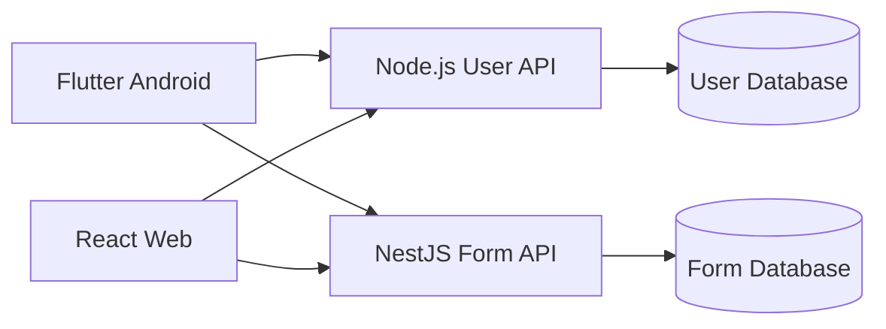

# 📖 Formatic

> Platform pembuatan dan pengerjaan formulir atau kuis, terinspirasi dari Google Forms.

Formatic memungkinkan pengguna membuat formulir, mengelola soal, dan mengerjakan soal dengan batas waktu. Aplikasi tersedia sebagai aplikasi mobile Android berbasis Flutter dan aplikasi web berbasis React.

## ⚙️ Fitur

- Login dan autentikasi pengguna.
- Membuat, melihat, memperbarui, dan menghapus soal (CRUD soal).
- Mengerjakan form atau kuis.
- Timer selama pengerjaan soal.
- Pemisahan data form dan data pengguna melalui dua database terpisah.

## 🛠️ Arsitektur

Formatic menggunakan beberapa aplikasi dan service yang memiliki tanggung jawab berbeda:

| Komponen | Teknologi | Tanggung jawab |
| --- | --- | --- |
| Mobile | Flutter | Client untuk Android |
| Web | React + Vite | Client untuk browser |
| Form API | NestJS | Form, soal, timer, dan proses pengerjaan |
| User API | Node.js | Login, autentikasi, dan data pengguna |
| Form database | Database terpisah | Menyimpan form, soal, jawaban, dan hasil pengerjaan |
| User database | Database terpisah | Menyimpan akun dan data pengguna |

Pemisahan database membantu membatasi tanggung jawab service dan menjaga agar data pengguna tidak bercampur langsung dengan data form. Client berkomunikasi dengan User API untuk autentikasi dan Form API untuk fitur formulir.



## 📁 Struktur Proyek

```text
.
├── apps/             # Aplikasi Frontend
│   ├── mobile/       # Aplikasi Flutter untuk Android
│   └── web/          # Aplikasi React 
├── services/         # Service backend 
│   ├── form-api/     # NestJS
│   └── user-api/     # Node.js
└── readme.md
```

> Saat ini repository berisi client pada `apps/mobile` dan `apps/web`. Folder `services/` dapat digunakan ketika service backend ditambahkan ke repository.

## Prasyarat

- Flutter SDK dengan Dart SDK yang memenuhi constraint pada `apps/mobile/pubspec.yaml`.
- Android Studio atau Android SDK untuk menjalankan aplikasi Android.
- Node.js dan npm untuk aplikasi web serta backend.
- Dua instance atau schema database: satu untuk Form API dan satu untuk User API.

## Menjalankan Aplikasi Web

```bash
cd apps/web
npm install
npm run dev
```

Perintah lain yang tersedia:

```bash
npm run lint
npm run build
npm run preview
```

## Menjalankan Aplikasi Mobile

```bash
cd apps/mobile
flutter pub get
flutter run
```

Pastikan emulator Android atau perangkat Android sudah terhubung sebelum menjalankan `flutter run`.

## Menjalankan Backend

Backend dibagi menjadi dua service yang dapat dijalankan secara terpisah:

### Setup Awal

1. Siapkan dua instance database terpisah (Form Database dan User Database).
2. Buat file `.env` di masing-masing service berdasarkan `.env.example`.
3. Konfigurasi environment variable untuk koneksi database.

### Form API (NestJS)

Service NestJS ini menangani:

- CRUD form dan soal.
- Penyimpanan jawaban dan hasil pengerjaan.
- WebSocket untuk real-time updates.

**Menjalankan Form API:**

```bash
cd services/form-api
npm install
npm run migrate      # Jalankan database migrations (jika ada)
npm run start:dev    # Development mode dengan auto-reload
```

Perintah lain yang tersedia:

```bash
npm run build        # Build untuk production
npm run start:prod   # Jalankan production build
npm run lint         # Jalankan linter
npm test            # Jalankan test suite
```

**Database Setup untuk Form API:**

Pastikan file `.env` sudah dikonfigurasi:

```env
DB_NAME     = YOUR_DB_NAME
DB_HOST     = YOUR_DB_HOST
DB_PASSWORD = YOUR_DB_PASSWORD
DB_USER     = YOUR_DB_USERNAME
PORT        = 4000

SECRET = "" # Same as SECRET From user-api
```

### User API (Node.js)

Service Node.js ini menangani:

- Registrasi dan login pengguna.
- Token atau session autentikasi.
- Validasi dan manajemen data pengguna.

**Menjalankan User API:**

```bash
cd services/user-api
npm install
npm run migrate      # Jalankan database migrations
node server
```

**Database Setup untuk User API:**

Pastikan file `.env` sudah dikonfigurasi:

```env
DB_NAME     = YOUR_DB_NAME
DB_HOST     = YOUR_DB_HOST
DB_PASSWORD = YOUR_DB_PASSWORD
DB_PORT        = 4000
DB_USER     = YOUR_DB_USERNAME

APP_PORT = 3000
SECRET = "" # Same as SECRET From user-api
```

**Catatan Penting:**

- Masing-masing service harus menggunakan konfigurasi koneksi database sendiri.
- Jangan mengarahkan Form API dan User API ke database yang sama.
- Simpan file `.env` lokal di luar version control dan jangan memasukkan kredensial database ke repository.

## Alur Penggunaan

1. Pengguna login melalui User API.
2. Client menerima session atau token autentikasi.
3. Pengguna membuat atau mengelola soal melalui Form API.
4. Peserta membuka form dan mengerjakan soal sebelum timer berakhir.
5. Jawaban dikirim ke Form API untuk divalidasi dan disimpan sebagai hasil pengerjaan.

## Tools & Testing

Folder `Testing_untuk_BE/` berisi:

- **HTML Testing Pages** - Interface untuk testing manual backend:
  - `index.html` - Dashboard utama
  - `create-soal.html` - Form pembuatan soal
  - `fill-form.html` - Form pengerjaan soal
  - `my-forms.html` - Daftar form pengguna
  - `dashboard.html` - Dashboard user

- **Python Scripts** - Utilities untuk parsing dan debugging:
  - `debug_math.py`, `debug_soal4.py` - Debug mathematical content
  - `inspect_docx.py` - Inspeksi file DOCX
  - `verify_*.py` - Verification scripts

- **Soal Template Generator** - Generate soal dari template:
  - `generate_soal.py` - Script untuk generate soal otomatis

## Status Pengembangan

- [x] Client Flutter tersedia di `apps/mobile`.
- [x] Client React tersedia di `apps/web`.
- [x] Implementasi Form API berbasis NestJS.
- [x] Implementasi User API berbasis Node.js.
- [x] Konfigurasi dan migrasi dua database terpisah.
- [x] Database seeders untuk testing.
- [x] Integrasi penuh client dengan Form API.
- [x] Integrasi penuh client dengan User API.


#
<div align="center">Dibuat dengan ❤️ oleh tim Formatic</div>