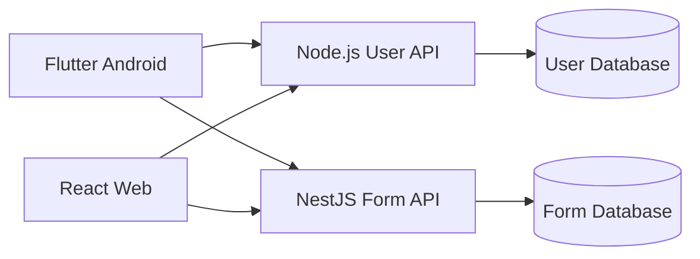

# 📖 FormMaker

> Platform pembuatan dan pengerjaan formulir atau kuis, terinspirasi dari Google Forms.

FormMaker memungkinkan pengguna membuat formulir, mengelola soal, dan mengerjakan soal dengan batas waktu. Aplikasi tersedia sebagai aplikasi mobile Android berbasis Flutter dan aplikasi web berbasis React.

## ⚙️ Fitur

- Login dan autentikasi pengguna.
- Membuat, melihat, memperbarui, dan menghapus soal (CRUD soal).
- Mengerjakan form atau kuis.
- Timer selama pengerjaan soal.
- Pemisahan data form dan data pengguna melalui dua database terpisah.

## 🛠️ Arsitektur

FormMaker menggunakan beberapa aplikasi dan service yang memiliki tanggung jawab berbeda:

| Komponen | Teknologi | Tanggung jawab |
| --- | --- | --- |
| Mobile | Flutter | Client untuk Android |
| Web | React + Vite | Client untuk browser |
| Form API | NestJS | Form, soal, timer, dan proses pengerjaan |
| User API | Node.js | Login, autentikasi, dan data pengguna |
| Form database | Database terpisah | Menyimpan form, soal, jawaban, dan hasil pengerjaan |
| User database | Database terpisah | Menyimpan akun dan data pengguna |

Pemisahan database membantu membatasi tanggung jawab service dan menjaga agar data pengguna tidak bercampur langsung dengan data form. Client berkomunikasi dengan User API untuk autentikasi dan Form API untuk fitur formulir.



## 📁 Struktur Proyek

```text
.
├── apps/             # Aplikasi Frontend
│   ├── mobile/       # Aplikasi Flutter untuk Android
│   └── web/          # Aplikasi React 
├── services/         # Service backend 
│   ├── form-api/     # NestJS
│   └── user-api/     # Node.js
└── readme.md
```

> Saat ini repository berisi client pada `apps/mobile` dan `apps/web`. Folder `services/` dapat digunakan ketika service backend ditambahkan ke repository.

## Prasyarat

- Flutter SDK dengan Dart SDK yang memenuhi constraint pada `apps/mobile/pubspec.yaml`.
- Android Studio atau Android SDK untuk menjalankan aplikasi Android.
- Node.js dan npm untuk aplikasi web serta backend.
- Dua instance atau schema database: satu untuk Form API dan satu untuk User API.

## Menjalankan Aplikasi Web

```bash
cd apps/web
npm install
npm run dev
```

Perintah lain yang tersedia:

```bash
npm run lint
npm run build
npm run preview
```

## Menjalankan Aplikasi Mobile

```bash
cd apps/mobile
flutter pub get
flutter run
```

Pastikan emulator Android atau perangkat Android sudah terhubung sebelum menjalankan `flutter run`.

## Backend

Backend dibagi menjadi dua service:

### Form API

Service NestJS ini menangani:

- CRUD form dan soal.
- Penyimpanan jawaban dan hasil pengerjaan.

### User API

Service Node.js ini menangani:

- Registrasi dan login.
- Token atau session autentikasi.

Masing-masing service harus menggunakan konfigurasi koneksi database sendiri. Jangan mengarahkan Form API dan User API ke database yang sama.

Contoh konfigurasi environment:

```env
# Form API
FORM_DATABASE_URL=<connection-ke-form-database>

# User API
USER_DATABASE_URL=<connection-ke-user-database>
```

Nama environment variable dan port dapat disesuaikan dengan implementasi backend. Simpan file environment lokal di luar version control dan jangan memasukkan kredensial database ke repository.

## Alur Penggunaan

1. Pengguna login melalui User API.
2. Client menerima session atau token autentikasi.
3. Pengguna membuat atau mengelola soal melalui Form API.
4. Peserta membuka form dan mengerjakan soal sebelum timer berakhir.
5. Jawaban dikirim ke Form API untuk divalidasi dan disimpan sebagai hasil pengerjaan.

## Status Pengembangan

- [ ] Client Flutter tersedia di `apps/mobile`.
- [ ] Client React tersedia di `apps/web`.
- [ ] Integrasi client dengan Form API.
- [ ] Integrasi client dengan User API.
- [ ] Implementasi Form API berbasis NestJS.
- [ ] Implementasi User API berbasis Node.js.
- [ ] Konfigurasi dan migrasi dua database terpisah.


#
<div align="center">Dibuat dengan ❤️ oleh tim FormMaker</div>